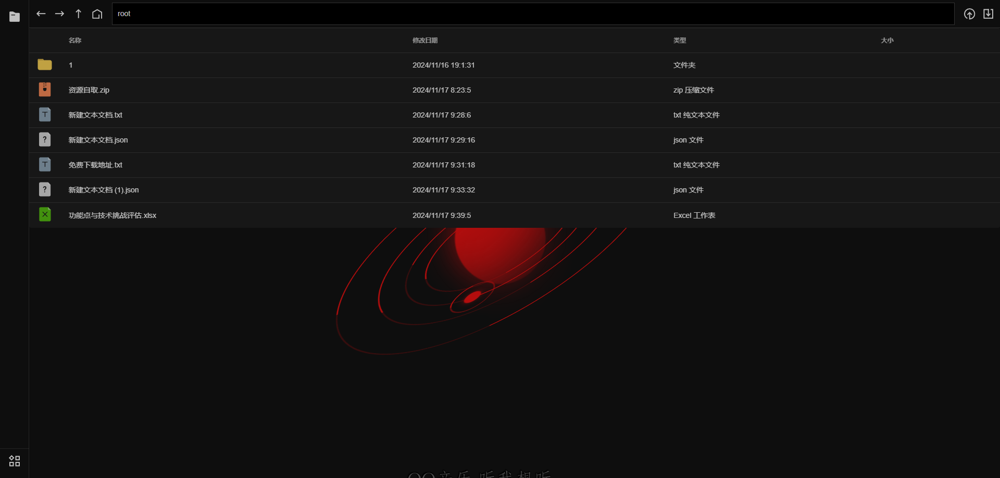

# rogaluna-web

包含多种功能的个人网站（写着玩的），需要启动 [rogaluna-server](https://github.com/Rogaluna/RogalunaServerByQt) （配套的服务器）

## 功能

* 设置

可进行用户基础设置和主体背景设置（未完成）

* 文件传输

在局域网内不同设备间的文件互传功能（未完成）

* 云存储

私人云盘



* 音乐台

私人音乐台


* 邮箱

未完成

* 图书馆

包含阅读和编写，应该可以将之前的经验与灵感保存下来


## Project setup

```
npm install
```

### Compiles and hot-reloads for development

```
npm run serve
```

### Compiles and minifies for production

```
npm run build
```

### Customize configuration

See [Configuration Reference](https://cli.vuejs.org/config/).
